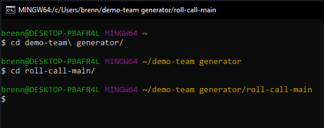

# Team Profile Generator

## Description
This command line application creates a website with information about members of your team.

## Table of Contents

* [Installation](#installation)
* [Usage](#usage)
* [Unit Tests](#unit-tests)
* [User Tests](#user-tests)
* [License](#license)

##  Installation

As this is just a class project, it has not been added for public use in the npm registry, so we will install it the long way - downloading the code via zip file.

A walkthrough video for these installation and usage instructions can be found here: 

Please note these installation instructions assume you already have Visual Studio Code installed, as well as Node.js.

Visual Studio Code: https://code.visualstudio.com/ 

Node.js: https://nodejs.org/en/

1. Click the Code button at the top right of this repository, then click Download ZIP.

2. Open the zip folder location once it completes downloading.

3. Right click on the zip file and select "Extract All..."

4. Browse for the location where you would like to extract the files.

## Usage

1. After the zip is extracted, open Git Bash (or similar terminal) and navigate to the location where you extracted the files, then navigate to the roll-call-main folder.

2. Run "npm i" to install the requisite libraries.

3. Enter "node index.js" to start the program. You will be presented with questions prompting for the team manager's information. After answering those questions, you will be presented with a menu giving you the option to add an engineer or an intern to the team.

4. You will be presented with questions about the engineer and then will be returned to the menu.

5. If you select to provide intern information, you will answer questions about the intern and then be returned to the menu. When you have finished building the team, select the "None, all team information has been entered" option.

6. Upon completion, you will be presented with a message stating the HTML file has been created based on the information you provided.

7. Change directories into the "dist" folder and run "start chrome index.html" to open the new website in Chrome.

## Unit Tests

## User Tests

## License

MIT License

Copyright (c) 2021 KU Coding Bootcamp

Permission is hereby granted, free of charge, to any person obtaining a copy
of this software and associated documentation files (the "Software"), to deal
in the Software without restriction, including without limitation the rights
to use, copy, modify, merge, publish, distribute, sublicense, and/or sell
copies of the Software, and to permit persons to whom the Software is
furnished to do so, subject to the following conditions:

The above copyright notice and this permission notice shall be included in all
copies or substantial portions of the Software.

THE SOFTWARE IS PROVIDED "AS IS", WITHOUT WARRANTY OF ANY KIND, EXPRESS OR
IMPLIED, INCLUDING BUT NOT LIMITED TO THE WARRANTIES OF MERCHANTABILITY,
FITNESS FOR A PARTICULAR PURPOSE AND NONINFRINGEMENT. IN NO EVENT SHALL THE
AUTHORS OR COPYRIGHT HOLDERS BE LIABLE FOR ANY CLAIM, DAMAGES OR OTHER
LIABILITY, WHETHER IN AN ACTION OF CONTRACT, TORT OR OTHERWISE, ARISING FROM,
OUT OF OR IN CONNECTION WITH THE SOFTWARE OR THE USE OR OTHER DEALINGS IN THE
SOFTWARE.